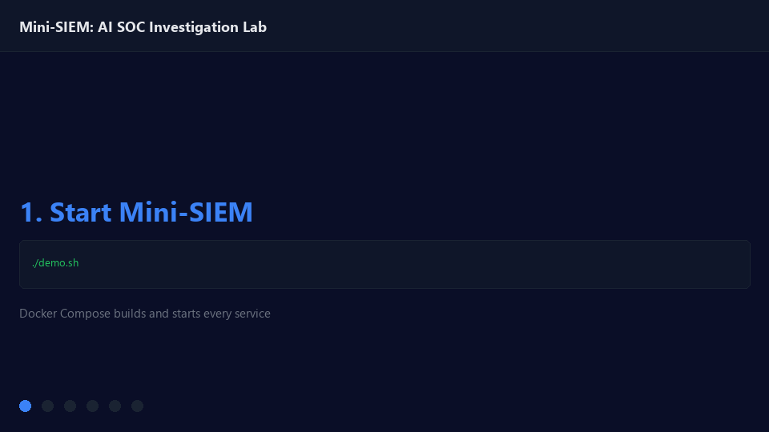
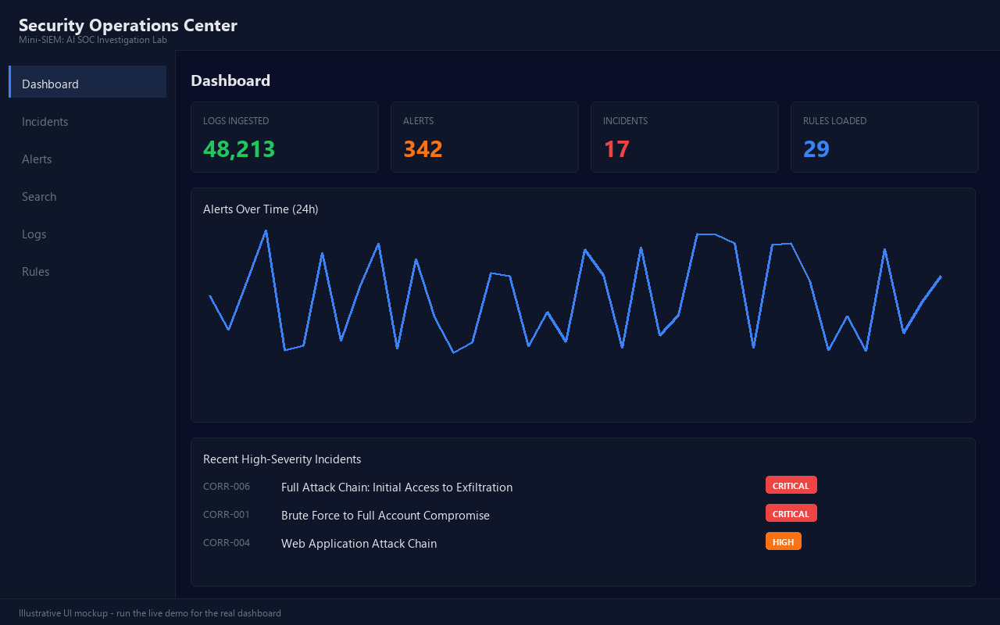
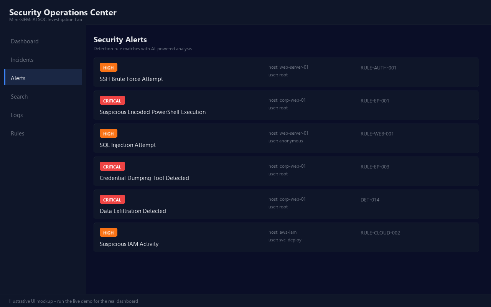
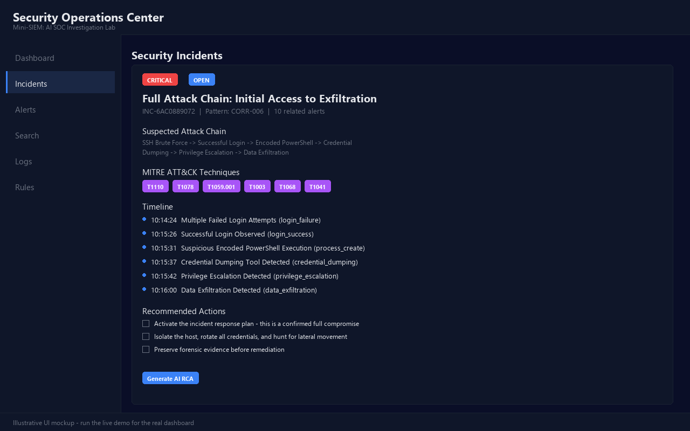
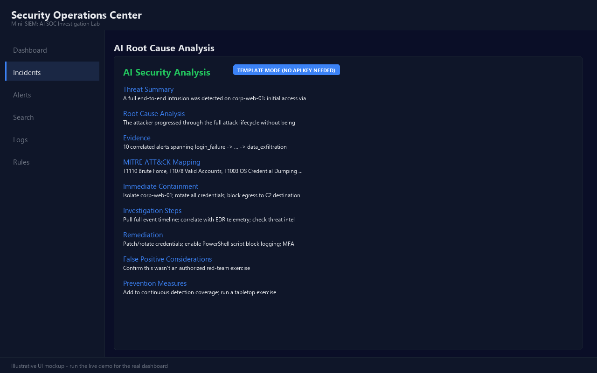
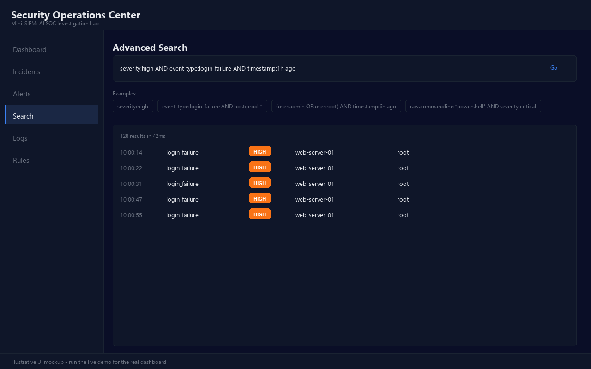

# Mini-SIEM: AI SOC Investigation Lab

**Mini-SIEM is an AI-assisted SOC investigation lab that turns raw logs into detections, correlated incidents, root cause analysis, MITRE ATT&CK mapping, and remediation reports.**

Built with Go, Python, OpenSearch, Docker, and React. Everything runs locally against synthetic data - no paid API key required for the core loop.



```
Raw logs -> normalized events -> detection alerts -> correlated incidents
         -> AI root cause analysis -> MITRE ATT&CK mapping
         -> remediation checklist -> exported incident report
```

## Why this exists

Most "SIEM demo" repos stop at ingestion + a dashboard. Mini-SIEM goes further: it ships a **synthetic attack replay engine**, a **categorized detection rule pack**, a **correlation engine that chains alerts into incidents**, and an **AI SOC agent that writes the root cause analysis** - with a deterministic, zero-cost fallback when no LLM key is configured. Run one command and watch a full intrusion get detected, correlated, explained, and exported.

## Quickstart

```bash
git clone <this repo>
cd mini-siem
cp .env.example .env          # optional: add GROQ_API_KEY for LLM-mode RCA
docker-compose up --build -d
python scripts/init-db.py
```

- **Dashboard:** http://localhost:3000
- **API health:** http://localhost:8000/health
- **API docs:** http://localhost:8000/docs
- **OpenSearch Dashboards:** http://localhost:5601

## One-command demo

```bash
./demo.sh        # Linux/macOS/WSL/Git Bash
demo.bat         # Windows
```

Starts every service, initializes OpenSearch, replays a full synthetic attack chain, waits for detection + correlation, and exports a sample incident report + AI RCA to `outputs/`. See [DEMO.md](DEMO.md) for the guided 90-second walkthrough.

## Attack Replay Mode

`scripts/replay_attack.py` generates realistic, entirely synthetic log sequences and feeds them into the ingestion pipeline so you can see detections and incidents fire on demand.

```bash
python scripts/replay_attack.py --list
python scripts/replay_attack.py --scenario ssh_bruteforce
python scripts/replay_attack.py --scenario full_attack_chain
```

| Scenario | What it triggers |
|---|---|
| `ssh_bruteforce` | `RULE-AUTH-001`, `CORR-002` |
| `successful_login_after_bruteforce` | `RULE-AUTH-002` (account compromise) |
| `web_sql_injection` | `RULE-WEB-001`, `RULE-WEB-003`, `CORR-004` |
| `path_traversal_attempt` | `RULE-WEB-002`, `RULE-WEB-003`, `CORR-004` |
| `suspicious_powershell` | `RULE-EP-001`, `RULE-EP-002`, `DET-001` |
| `admin_login_anomaly` | `RULE-AUTH-003` |
| `privilege_escalation` | `CORR-003` |
| `data_exfiltration_pattern` | `CORR-005` |
| `full_attack_chain` | The full kill chain end to end - `CORR-001/002/003/005/006` |

Details in [docs/ATTACK_REPLAY.md](docs/ATTACK_REPLAY.md). **Safety:** every scenario only generates synthetic log entries sent to your own local API - no real exploits, network scanning, or malware are involved.

## Detection Rule Pack

`rules/` is organized by domain, each rule fully documented (MITRE technique, false positives, remediation, sample log):

```
rules/
  auth/       ssh_bruteforce, successful_login_after_failures, admin_login_anomaly
  web/        sql_injection_attempt, path_traversal_attempt, suspicious_user_agent
  endpoint/   powershell_encoded_command, suspicious_process_chain, credential_dumping_pattern
  cloud/      public_s3_access, suspicious_iam_activity
```

The engine also supports **threshold/aggregation rules** (Sigma-style "N events per entity per time window") and **sequence rules** consumed by the correlation engine. Legacy rules in `detection-engine/rules/` keep working side by side. See [docs/DETECTION_ENGINE.md](docs/DETECTION_ENGINE.md).

## Correlated Incidents

The correlation engine groups related alerts - by host, user, or IP - into a single incident using ordered, time-windowed attack-chain patterns:

```
5x failed SSH login + successful login + privilege escalation
= "Brute Force to Full Account Compromise" incident (CORR-001)
```

Each incident carries `incident_id`, `title`, `severity`, `status`, `related_alerts`, `timeline`, `affected_assets`, `suspected_attack_chain`, `mitre_techniques`, and `recommended_actions`. Incident IDs are deterministic, so re-running correlation over an overlapping window updates the same incident instead of creating duplicates. See [docs/DETECTION_ENGINE.md](docs/DETECTION_ENGINE.md).

## AI SOC Agent

Every incident can get a structured root cause analysis with one click (or one API call):

- **LLM mode:** uses Groq's Llama 3.3 70B when `GROQ_API_KEY` is set.
- **Template mode:** a deterministic, offline RCA generator when it isn't - same structure, zero cost, zero external dependency.

Either way you get: threat summary, root cause analysis, evidence, MITRE ATT&CK mapping, immediate containment, investigation steps, remediation, false-positive considerations, and prevention measures. See [docs/AI_SOC_AGENT.md](docs/AI_SOC_AGENT.md).

## Advanced Search

A Splunk/Elasticsearch-style query language over logs and alerts:

```
severity:high
event_type:login_failure AND host:prod-*
(user:admin OR user:root) AND timestamp:6h ago
raw.commandline:*powershell* AND severity:critical
```

Supports boolean operators, wildcards, CIDR matching, range queries, saved searches, and natural-language-to-query conversion via the AI agent.

## Sample Reports

```bash
python scripts/generate_incident_report.py --incident latest
```

Exports:
- `outputs/sample_alerts.json`
- `outputs/sample_incident_report.md`
- `outputs/sample_ai_rca_report.md`
- `outputs/sample_incident_timeline.json`

Works against a live stack, or fully offline (`--offline`) by generating and correlating a synthetic sample locally - useful for CI. See [docs/INCIDENT_REPORTING.md](docs/INCIDENT_REPORTING.md).

## Screenshots

| Dashboard | Alerts | Incident + AI RCA |
|---|---|---|
|  |  |  |

| AI Root Cause Analysis | Advanced Search |
|---|---|
|  |  |

*(These are illustrative UI mockups generated to match the app's actual theme - run the live demo to see the real dashboard.)*

## Architecture

```
                          +----------------------+
 [Synthetic/real logs] -> |  Syslog (Go) / API   |
                          +-----------+----------+
                                      v
                          +----------------------+
                          |     Normalizer        |  parser/normalizer.py
                          | (schema + event_type)  |
                          +-----------+----------+
                                      v
                          +----------------------+
                          |     OpenSearch         |  logs / alerts / incidents /
                          |                        |  ai_rca / saved_searches
                          +----+--------------+----+
                               |              |
                  +------------+              +------------+
                  v                                         v
      +------------------------+              +------------------------+
      |   Detection Engine       |              |   Advanced Search        |
      |  rules/ + legacy rules   |              |  (query DSL parser)      |
      |  single/threshold rules  |              +------------------------+
      +------------+-------------+
                   v
      +------------------------+       +---------------------------+
      |  Correlation Engine      |  ->  |   AI SOC Agent              |
      |  sequence patterns +     |      |  Groq LLM or template RCA   |
      |  rules/*.yml sequences   |      +---------------------------+
      +------------+-------------+
                   v
      +------------------------+
      |      React UI             |  Dashboard / Incidents / Alerts /
      |  (dashboard, incidents)   |  Search / Logs / Rules
      +------------------------+
```

Full breakdown in [docs/ARCHITECTURE.md](docs/ARCHITECTURE.md).

## Safety Notice

This project is for **local, educational, and defensive security use only**.

- All attack scenarios generate **synthetic log entries only** - no real exploits, payloads, or network traffic against any system.
- No malware, no destructive actions, no external targeting.
- Nothing here requires a paid API key to run the full detection -> correlation -> RCA -> report loop.
- Do not point the syslog server or ingestion API at production systems without your own review.

## Roadmap

See [docs/ROADMAP.md](docs/ROADMAP.md) - highlights: Sigma rule import, risk scoring, SOAR-style automated response actions (block IP, disable user), ML-based anomaly detection, multi-tenant support.

## Documentation

- [docs/CASE_STUDY.md](docs/CASE_STUDY.md) - a worked example, start to finish
- [docs/ARCHITECTURE.md](docs/ARCHITECTURE.md)
- [docs/DETECTION_ENGINE.md](docs/DETECTION_ENGINE.md)
- [docs/AI_SOC_AGENT.md](docs/AI_SOC_AGENT.md)
- [docs/ATTACK_REPLAY.md](docs/ATTACK_REPLAY.md)
- [docs/INCIDENT_REPORTING.md](docs/INCIDENT_REPORTING.md)
- [docs/ROADMAP.md](docs/ROADMAP.md)
- [RELEASE_NOTES.md](RELEASE_NOTES.md)

## API Endpoints

| Endpoint | Description |
|---|---|
| `POST /ingest` | Submit logs (single or batch) |
| `GET /health` | Health check |
| `GET /stats` | Ingestion + engine statistics |
| `GET /rules` | Loaded detection rules |
| `GET /alerts` | Recent alerts |
| `GET /incidents` | Recent correlated incidents |
| `PUT /incidents/{id}/investigate` `/resolve` `/status` | Incident lifecycle |
| `POST /ai/rca/{incident_id}` | Generate (or fetch cached) AI RCA |
| `GET /search` | Advanced query search |
| `POST /ai/convert-query` | Natural language -> query syntax |

Full list at http://localhost:8000/docs once running.

## Manual log ingestion

```bash
python scripts/send-log.py
echo '<14>Jan 25 15:00:00 hostname app: test' | nc -u localhost 514
```

## Verify everything works

```bash
python scripts/verify_demo.py
```

Checks required files exist, rules load, sample logs can be generated, reports can be generated, and demo commands are valid - no Docker required.
